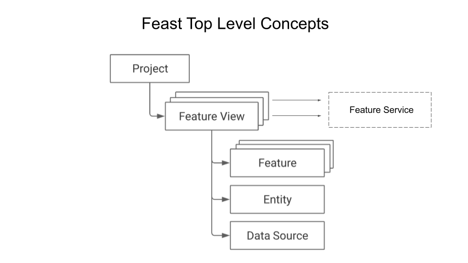

### Module 1
This module will focus on understanding key concepts and Feast objects. In this module we will:
 * Deploy a local feature store with a Parquet file offline store and Sqlite online store.
 * Build a training dataset using our time series features from our Parquet files.
 * Materialize feature values from the offline store into the online store.
 * Read the latest features from the online store for inference.

In particular, we'll cover the following:
 * Introduction to Feature Stores
   * what are they, what problems they solve, and why you need them
   * What is Feast and why
   * Key concepts in Feast
     * Projects
     * Feast Repos
     * Data Source
     * Entity
     * Features and Features Views
     * Feature Service
     * Offline & Online Stores
   * Learn Feast APIs
     * Declare and define Feast Object using Feast Declarative APIs
     * Use an IDE, Google Colab or Jupyter Notebook demonstrating how to use Feast APIs




A Feast project directory structure, `feature_repo`, it houses all Python files with declarative definitions.
* [Data Source](feature_repo/datasources/filesource.py)
* [Entity](feature_repo/entities/entity.py)
* [Feature](feature_repo/features/feature_views.py)
* [Feast config](feature_repo/feature_store.yaml)

For modularity, I refactored Python files generated by the Feast CLI `feast init feature_repo`. Instead of having
all declarations and definitions in single `.py` file, I have chosen to modularize the directory structure that
maps to each Feast high-level concept and object.

### Setup and Installation

#### Step 1: 
``` conda create --name feast_workshop ```
#### Step 2:
``` conda activate feast_workshop ```
#### Step 3: 
``` pip install feast ```
#### Step 4:
``` feast version ```

Feast SDK Version: "feast 0.11.0"

### Defining and Declaring your Feast Objects

#### Step 1: Peruse the Python files and 
* Read [Data Source](feature_repo/datasources/filesource.py)
* Read [Entity](feature_repo/entities/entity.py)
* Read [Feature](feature_repo/features/feature_views.py)
* Read [Feast config](feature_repo/feature_store.yaml)

### Step 2: Register feature definitions and deploy your feature store
```cd <your_cloned_git_dir>/feast_workshops/module_1/feature_repo```
``` feast apply ```
### Step 3: Generating training data
The `feast apply` command builds a training dataset based on the time-series features defined in the 
feature repository [Feature](feature_repo/features/feature_views.py)

```cd <your_cloned_git_dir>/feast_workshops/module_1/feature_repo```

### Step 4: Load features into your online store
The `feast materialize` command loads the latest feature values from your feature views into your online store.
That is, it populates these features from the offline store into offline store, our local SQLite database,
defined in `feature_store.yaml.` 

Informing to populate online store starting at this time going back in time. 

```cd <your_cloned_git_dir>/feast_workshops/module_1/feature_repo```

```feast materialize-incremental $(date -u +"%Y-%m-%dT%H:%M:%S")```

Materializing 1 feature views to 2021-07-29 10:45:23-07:00 into the SQLite online store.

driver_hourly_stats from 2021-07-28 17:45:38-07:00 to 2021-07-29 10:45:23-07:00

### Step 5: Fetch a feature vector from your online store

``cd <your_cloned_git_dir>/feast_workshops/module_1/feature_repo/queries```

```python fvector.py```

<hr style="border:3px solid gray"> </hr>

Alternatively, you could do all the above steps in a single file using the SDK API

### Step 1: Use SDK or run from Jupyter notebook
```cd <your_cloned_git_dir>/feast_workshops/module_1/feature_repo\queries```

```python driver.py``` or ```jupyter lab driver.ipynb```

### Step 2: Try some Feast CLI commands

 1. `feast --help`
 2. `feast feature-views list`
 3. `feast entities list`
 4. `feast registry-dump`
